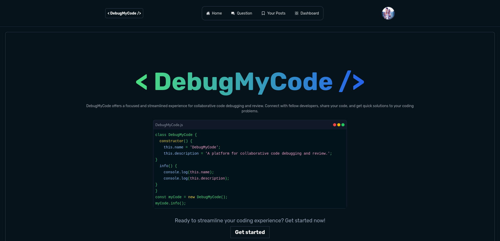

# DebugMyCode

DebugMyCode is a collaborative platform designed for developers to meet, discuss, and help each other debug code. It features functionalities such as posting questions, commenting, liking, sharing posts, and real-time chat. The goal of this project is to create a supportive community where developers can enhance their skills and solve coding issues together.

## Project Screenshot



## Developers

- **Emran Mohammed** - Frontend Engineer
- **Bethlehem Getachew** - Backend Engineer

## Getting Started

Follow these instructions to clone the code, install the necessary packages, and run the project on your local machine.

### Prerequisites

- Node.js and npm installed on your machine

### Cloning the Repository

1. Open your terminal or command prompt.
2. Clone the repository using the following command:

   ```bash
   git clone https://github.com/zeshaninsta/debugmycode
   ```

3. Navigate to the project directory:

   ```bash
   cd debugmycode
   ```

### Installing Packages

1. Install the necessary React packages by running:

   ```bash
   npm install
   ```

### Running the Project

1. Start the development server:

   ```bash
   npm run dev
   ```

2. Open your browser and go to `http://localhost:5173` to view the project.

## Usage

- **Posting Questions:** Users can post their coding questions.
- **Commenting:** Other developers can comment on the posts to provide solutions.
- **Liking and Sharing:** Users can like and share posts to support useful content.
- **Chat Functionality:** Developers can chat in real-time to discuss issues and solutions.

We hope DebugMyCode serves as a valuable resource for the developer community. Happy coding!

## Links

- **GitHub Repository:** [DebugMyCode GitHub](https://github.com/zeshaninsta/debugmycode)
- **Deployed Project:** [DebugMyCode Live](https://debugmycode.onrender.com)
- **Project Landing Page:** [DebugMyCode](https://debugmycode.onrender.com)

## Contact

For any inquiries, feel free to reach out to us via our LinkedIn profiles:

- [Emran Mohammed](https://www.linkedin.com/in/zeshaninsta)
- [Bethlehem Getachew](https://www.linkedin.com/in/bethlehem-getachew-52b85827b/)
